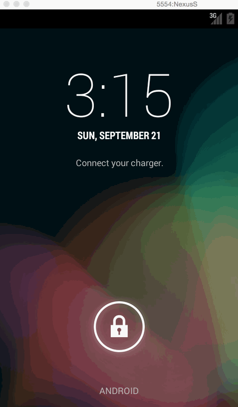

TwitterClient
=============

An example Twitter client for the CodePath exercise #3. This is an Android demo application for using the Twitter API and viewing the results in an infinite scrolling list view. 

Time spent: 6 hours spent in total

Completed user stories:
 
 * [x] User can sign in using OAuth login flow
 * [x] User can view last 25 tweets from their home timeline
    User should be able to see the user, body and timestamp for tweet
    User should be displayed the relative timestamp for a tweet "8m", "7h"
 * [x] Optional: Links in tweets are clickable and viewable
 * [x] User can load more tweets once they reach the bottom of the list using "infinite scroll" pagination
 * [x] User can compose a new tweet
    User can click a “Compose” icon in the Action Bar on the top right
    User will have a Compose view opened
    User can enter a message and hit a button to post to twitter
    User should be taken back to home timeline with new tweet visible
 * [x] Optional: Improve the user interface and theme the app to feel twitter branded
 
Notes:
There are a few fixes needed:
 * [x] It would be better to show a spinner in the image view while the image loads. Right now it just pops in.
 * [x] And when the list view item is being reused, I should clear the image right away, right now it switches from the old image to the new one.

Walkthrough of all user stories:
(Note, sometimes the emulator and LICECap don't play nicely. Notice a few keystrokes and the login screen didn't get captured. But they are there.)

